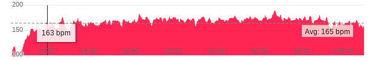
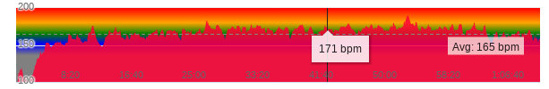

# Sauce for Garmin

Browser extension enhancing the Garmin Connect website 

# Features
* Display HR zone bands in the Heart Rate plot
  Original HR plot:
  

  HR plot with the zones overlay:
  

# Usage
* `sudo npm install --global web-ext`
* `web-ext lint`
* `web-ext build`

# Disclaimer
The name is inspired by [Sauce for Strava](https://saucellc.io/)

Watch Icon is from the [Google Material Design icon set](https://fonts.google.com/icons?icon.query=watch) licensed under [Creative Commons Attribution-ShareAlike](https://creativecommons.org/licenses/by-sa/3.0/).

# License
See the `LICENSE` file